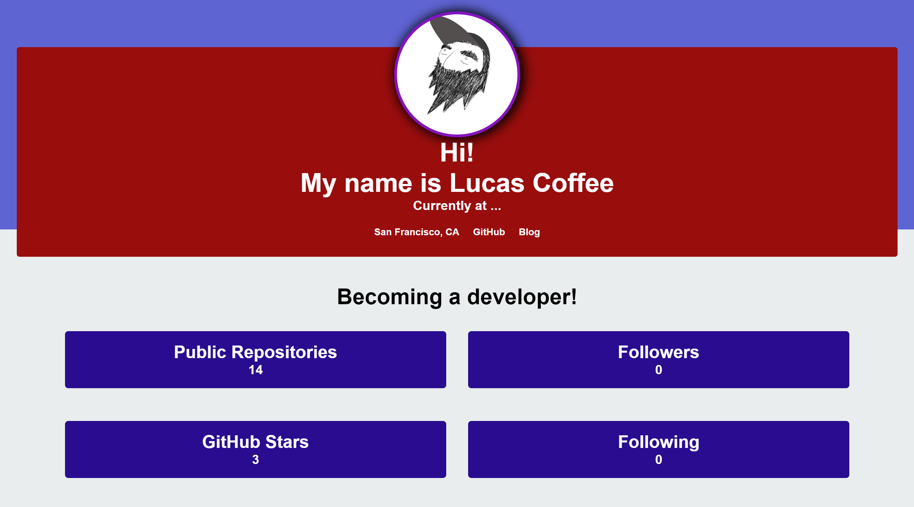

# Node.js_and_ES6 (Profile Generator)
Generate a profile based on your github after filling in some blanks!

### Prerequisites

A for of command line interface, such as gitbash. 

### Installing

In cli, navigate to the folder containing everything. enter 'npi install'. then enter 'node index.js' and respond to the prompts.

## Built With

* [HTML](https://developer.mozilla.org/en-US/docs/Web/HTML)
* [CSS](https://developer.mozilla.org/en-US/docs/Web/CSS)
* [Javascript](https://developer.mozilla.org/en-US/docs/Web/JavaScript)

## Author
* Lucas Coffee 

- [Link to Portfolio Site](https://kalashnikoffee.github.io/responsive-bio/)
- [Link to Github](https://github.com/kalashnikoffee)
- [Link to LinkedIn](https://www.linkedin.com/in/lucas-coffee-08853719/)

## License

This project is licensed under the MIT License 

## Acknowledgments

Thanks again to Jerome, Kerwin, and Mahisha for their guidance.
